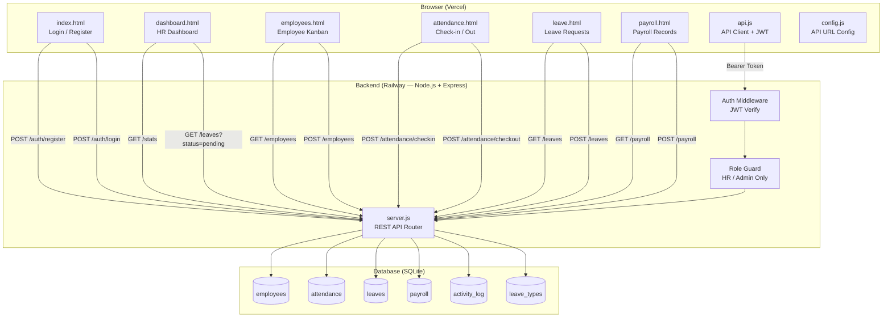
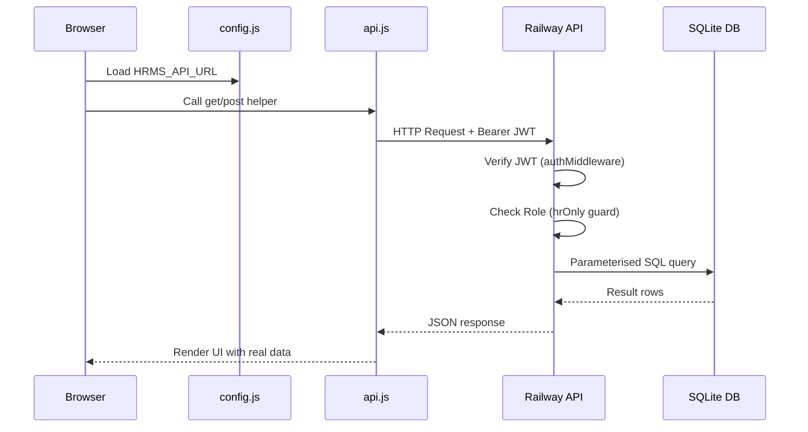
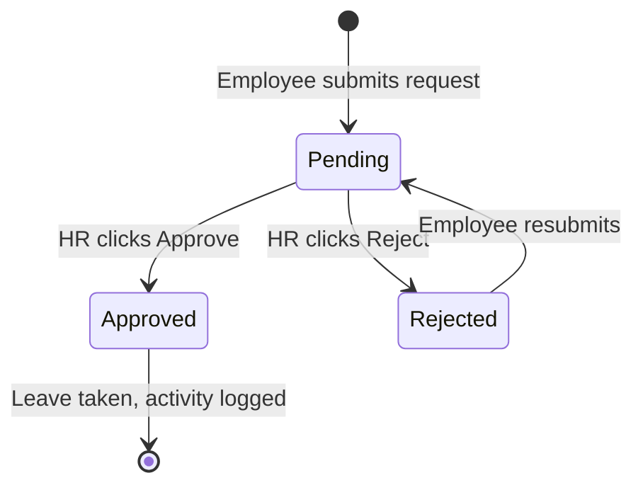
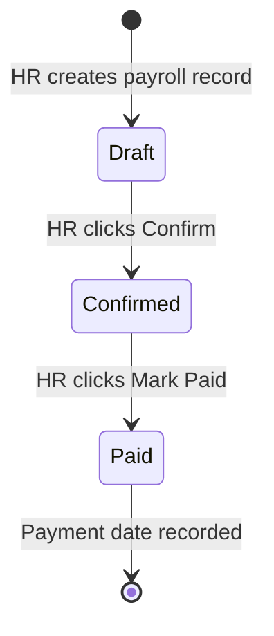
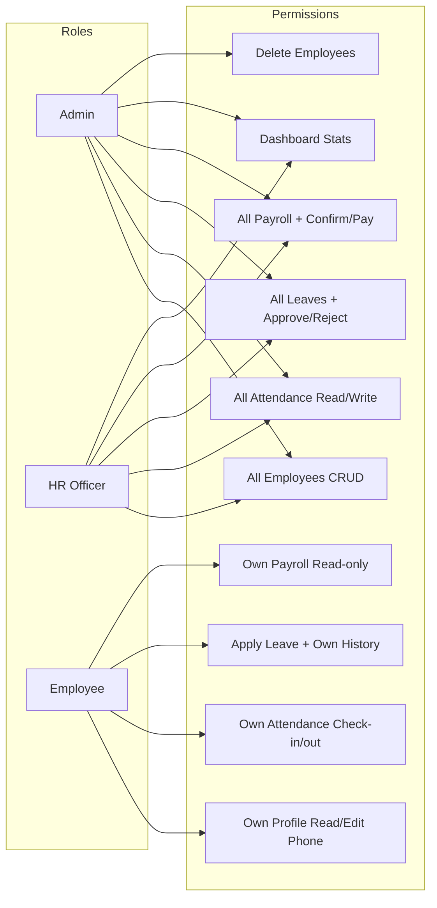

# Odoo HRMS — AU Hackathon 2026

> **Every workday, perfectly aligned.**

A full-stack Human Resource Management System built for the Odoo × AU Hackathon 2026 — zero hardcoded data, real SQLite database, JWT auth, and role-based access control.

---

## Live Demo

| | URL |
|---|---|
| **Frontend (Vercel)** | **[https://odoo-x-au.vercel.app](https://odoo-x-au.vercel.app)** |
| **Backend API (Railway)** | [https://odoo-x-au-production.up.railway.app](https://odoo-x-au-production.up.railway.app) |

> Register a new account on first visit — no demo data, all data is real and persisted.

---

## Problem Statement

HR departments in small and mid-sized organizations still rely on spreadsheets, manual registers, and disconnected tools to manage employee attendance, leaves, and payroll. This leads to:

- **Data inconsistency** — same employee record updated in multiple places
- **Approval delays** — leave requests sent over email with no tracking
- **Zero visibility** — employees have no real-time view of their attendance or leave balance
- **Security gaps** — no role-based access, any staff can see payroll data
- **No audit trail** — no record of who approved what and when

---

## Our Solution

A centralized, role-aware HRMS platform that replaces scattered tools with a single source of truth:

- Every employee, attendance record, leave request, and payroll entry lives in one **SQLite database** accessed via a secure **REST API**
- **JWT-based auth** ensures every request is verified and role-enforced server-side
- HR Officers get full management controls; Employees get a self-service portal
- Real-time **dashboard KPIs** pull live counts — present today, pending approvals, on leave
- **Approval workflow** with full audit trail — every approval/rejection is logged with timestamp and actor
- Deployed on **Vercel + Railway** — accessible from any device, no installation required

---

## Target Users

| User Type | Who They Are | What They Need |
|---|---|---|
| **Admin** | CEO / IT Admin | Full system control, employee management, audit logs |
| **HR Officer** | HR Manager / HR Executive | Manage employees, approve leaves, run payroll, view all attendance |
| **Employee** | Any staff member | View own profile, check in/out, apply for leave, view own payslip |

### Primary Target Organizations
- Small & mid-sized companies (10–500 employees)
- Educational institutions managing staff
- Startups that need HR operations without an expensive ERP

---

## What Makes This Unique

### Existing Tools vs Odoo HRMS

| Feature | Spreadsheets | Odoo Enterprise | Generic HR SaaS | **This System** |
|---|---|---|---|---|
| Real-time data | No | Yes | Yes | **Yes** |
| Role-based access | No | Yes | Partial | **Yes (3 levels)** |
| Self-service portal | No | Yes | Yes | **Yes** |
| Leave approval workflow | No | Yes | Yes | **Yes + audit log** |
| Attendance check-in/out | No | Yes | Partial | **Yes (real timestamps)** |
| Payroll lifecycle | No | Yes | Yes | **Yes (draft→confirmed→paid)** |
| Open source & hackable | No | Partial | No | **Yes (MIT)** |
| Zero setup cost | Yes | No (~$20/user/mo) | No (~$6–15/user/mo) | **Yes (free tier)** |
| No vendor lock-in | Yes | No | No | **Yes** |
| Custom branding | No | Paid | Paid | **Yes (Odoo logo, full CSS)** |
| Runs without install | Yes | No | Yes | **Yes (browser only)** |
| Odoo module included | No | N/A | No | **Yes (Odoo 17 module)** |

---

## System Architecture



---

## Request / Response Pipeline



---

## Leave Approval Workflow



---

## Payroll Lifecycle



---

## Role-Based Access Matrix



---

## Features

| Module | Description |
|---|---|
| **Authentication** | Register / Login with JWT, bcrypt password hashing |
| **Employee Profiles** | Kanban cards with status dots, search/filter, add/view modals |
| **Attendance** | Real-time check-in/out, work hours calc, weekly bar chart, CSV export |
| **Leave & Time-Off** | Interactive calendar, leave balance tracking, HR approval panel |
| **Payroll** | Salary components, deductions, net pay, full lifecycle workflow |
| **Dashboard** | Live KPIs from DB, pending approvals table, activity log |

---

## Tech Stack

| Layer | Technology |
|---|---|
| Frontend | Vanilla HTML5 + ES Modules + CSS3 (Inter font) |
| API Server | Node.js 24 + Express 4 |
| Database | SQLite via better-sqlite3 |
| Authentication | JWT (jsonwebtoken) + bcrypt |
| Frontend Deploy | Vercel (auto-deploy from GitHub) |
| Backend Deploy | Railway (auto-deploy from GitHub) |
| Odoo Module | Python 3 + Odoo 17 ORM |

---

## Local Development

```bash
# 1. Clone
git clone https://github.com/AGNI-911-69/odoo-x-au.git
cd odoo-x-au

# 2. Backend
cd backend
npm install
node server.js        # http://localhost:3000

# 3. Frontend (new terminal)
cd ../frontend
python -m http.server 8080   # http://localhost:8080
```

Or double-click **`start.bat`** in the root folder.

For local dev, set in `frontend/config.js`:
```js
window.HRMS_API_URL = 'http://localhost:3000/api';
```

---

## Running Tests

```bash
cd backend
node test_api.js   # requires server running — 35/35 tests passing
```

Test coverage: Auth, Employees, Attendance, Leaves, Payroll, Stats, all role guards.

---

## Project Structure

```
odoo-x-au/
├── start.bat                   ← one-click local launcher
├── backend/
│   ├── server.js               ← REST API (Express + JWT auth)
│   ├── db.js                   ← SQLite schema + auto EMP sequence
│   ├── seed.js                 ← first-admin interactive setup
│   ├── test_api.js             ← 35-test automated API suite
│   ├── Procfile                ← Railway deployment config
│   └── package.json
├── frontend/
│   ├── config.js               ← API URL (swap for local/prod)
│   ├── api.js                  ← API client + SVG icons + helpers
│   ├── style.css               ← full design system
│   ├── index.html              ← login + register
│   ├── dashboard.html          ← HR live dashboard
│   ├── employees.html          ← employee management
│   ├── attendance.html         ← attendance tracking
│   ├── leave.html              ← leave management
│   ├── payroll.html            ← payroll management
│   └── company logo/           ← Odoo branding assets
└── hrms_module/                ← Odoo 17 Python module
    ├── models/                 ← ORM models
    ├── views/                  ← XML views (kanban/list/form/calendar)
    └── security/               ← access rights + record rules
```

---

## API Reference

| Method | Endpoint | Access |
|---|---|---|
| POST | `/api/auth/register` | Public |
| POST | `/api/auth/login` | Public |
| GET | `/api/auth/me` | Auth |
| GET / POST | `/api/employees` | Auth |
| GET / PUT | `/api/employees/:id` | Auth |
| DELETE | `/api/employees/:id` | Admin only |
| GET | `/api/attendance` | Auth |
| POST | `/api/attendance/checkin` | Auth |
| POST | `/api/attendance/checkout` | Auth |
| GET | `/api/leave-types` | Auth |
| GET / POST | `/api/leaves` | Auth |
| POST | `/api/leaves/:id/approve` | HR only |
| POST | `/api/leaves/:id/reject` | HR only |
| GET / POST | `/api/payroll` | Auth |
| POST | `/api/payroll/:id/confirm` | HR only |
| POST | `/api/payroll/:id/markpaid` | HR only |
| GET | `/api/stats` | Auth |

---

*Built for the Odoo × AU Hackathon 2026*
